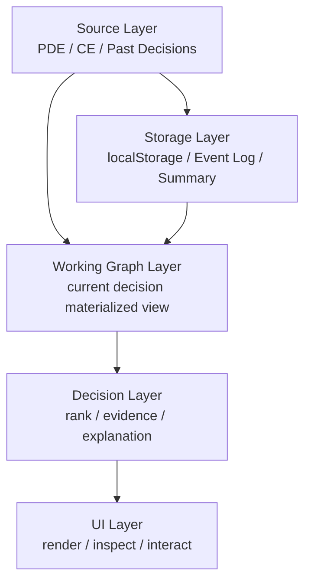
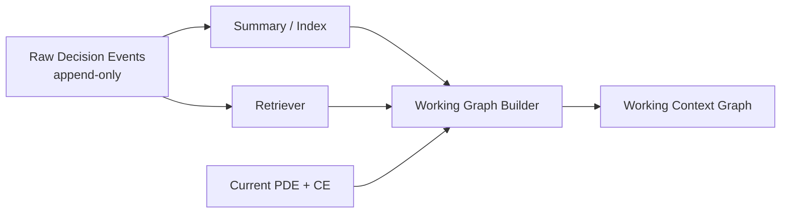
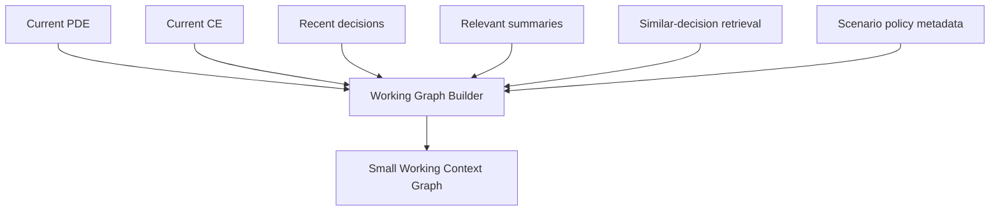
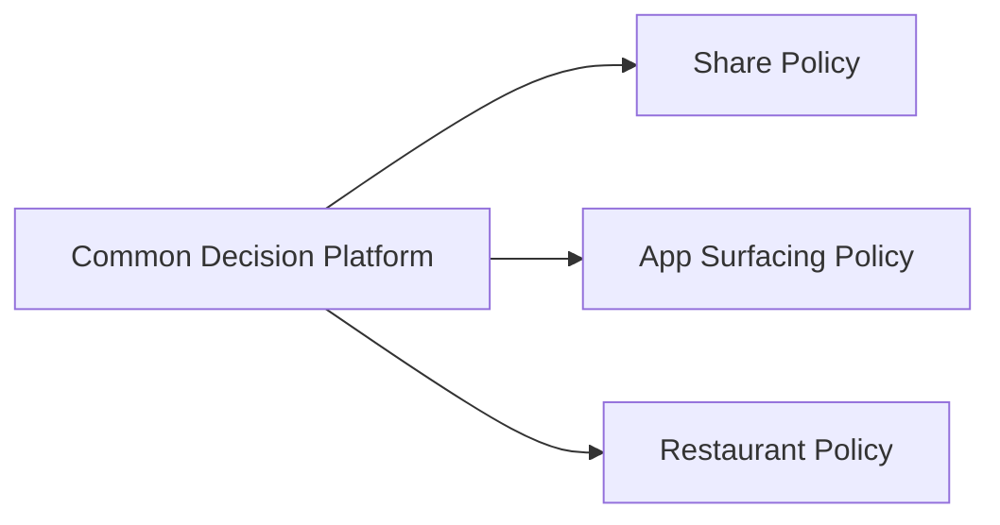
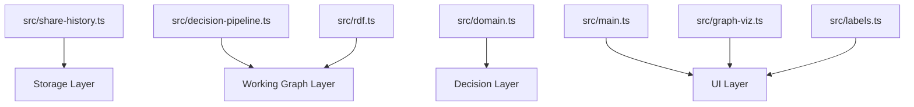
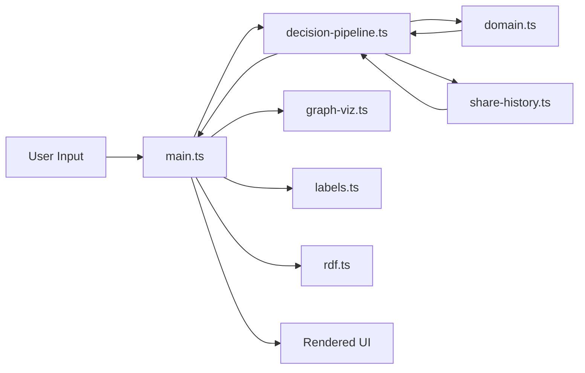
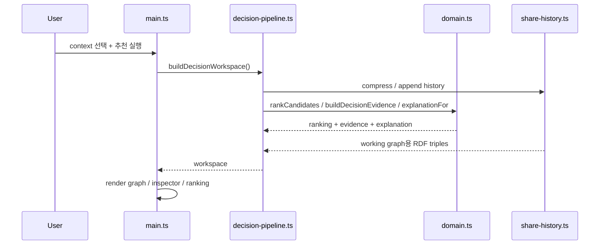
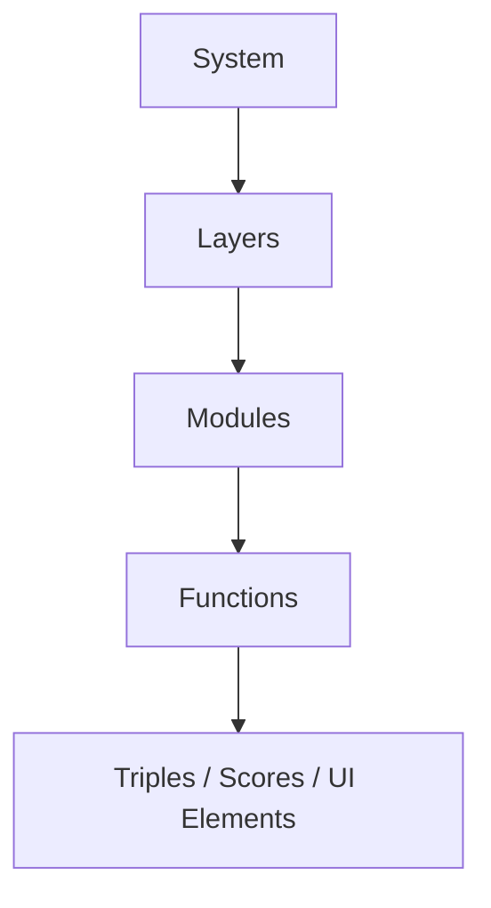

# Decision Architecture Guide

> 큰 그림에서 시작해서, 점점 더 세분화해서 보는 구조 설명서입니다.
>
> 목적: 이 demo가 어떤 경계(boundary)로 나뉘어 있고, 각 파일/모듈이 무엇을 책임지는지 한 번에 이해할 수 있게 만든다.

## 0. 한 줄 요약

이 프로젝트는 `share 추천 앱`이 아니라, `PDE + CE + past decisions`를 결합해 현재 상황에 맞는 결정을 내리는 `decision workspace` demo입니다.

핵심 원칙은 아래 3개입니다.

1. 저장은 크게 한다
2. 계산은 작게 한다
3. UI는 조립과 렌더링만 한다

---

## 1. System View: 전체를 먼저 보기

가장 바깥에서 보면 시스템은 다음 5개 레이어로 나뉩니다.

### 레이어별 역할

| Layer | 책임 | 하지 않는 일 |
|---|---|---|
| Source | 장기 컨텍스트(PDE), 실시간 컨텍스트(CE), 과거 결정의 입력 제공 | 저장/렌더링/점수화 |
| Storage | raw event, summary, index 보관 | 화면 표시 |
| Working Graph | 현재 decision에 필요한 데이터만 조립 | 전체 저장소를 통째로 노출 |
| Decision | ranking, evidence, explanation 생성 | DOM 조작 |
| UI | 사용자 입력/렌더링/상호작용 | scoring 규칙의 직접 구현 |

### 이 문장에서 이해하면 좋습니다

- Source = 재료(raw ingredients)
- Storage = 냉장고/창고
- Working Graph = 오늘 요리할 만큼만 꺼낸 재료
- Decision = 실제 조리 로직
- UI = 접시와 플레이팅

---

## 2. Boundary View: 저장소와 작업 그래프는 다르다

이 프로젝트의 가장 중요한 boundary는 `storage`와 `working graph`의 분리입니다.

### boundary 규칙

- raw event는 append한다
- 하지만 raw 전체를 매번 화면/계산 그래프에 올리지 않는다
- 현재 판단에는 `recent raw + summary + retrieval result`만 사용한다

즉:

- `Storage` = 길게 보관하는 영역
- `Working Graph` = 지금 판단에 필요한 것만 모은 작은 영역

### 왜 이렇게 나누는가

- 메모리/렌더링 비용을 bounded하게 유지
- 최근 행동은 high-fidelity로 반영
- 오래된 행동은 summary만 남겨도 충분
- 설명 가능한 그래프를 작은 크기로 유지

---

## 3. Working Graph View: 현재 결정을 위한 작은 graph

Working graph는 `한 번의 decision`을 위해 조립되는 materialized view입니다.

### 포함 대상

- 현재 scenario에 관련된 entity
- 최근 raw event 일부
- retrieval score가 높은 과거 decision
- 시각화 가능한 summary

### 제외 대상

- 전체 raw event dump
- 현재 decision과 무관한 오래된 fact
- 사용자에게 설명하기 어려울 정도로 큰 subgraph

---

## 4. Decision View: 공통 platform과 scenario policy 분리

공통 플랫폼과 시나리오 정책을 분리하면 재사용성이 좋아집니다.

### Common platform

공통 플랫폼은 아래를 담당합니다.

- PDE / CE / history 읽기
- working graph 조립
- evidence 생성
- retention / summary 규칙
- 후보 평가 파이프라인의 공통 틀

### Scenario policy

시나리오별 정책은 아래를 담당합니다.

- 후보 타입
- 점수화할 signal
- scoring / ranking 공식
- hard constraint / fallback
- success / failure / ignore의 의미

### 현재 demo에서의 해석

이 demo는 `share` scenario 한 개만 가지고 있지만, 구조상 다음으로 확장 가능합니다.

- app surfacing
- restaurant recommendation
- intent-based action surfacing

---

## 5. Module View: 파일이 어디에 속하는가

아래는 코드 파일을 아키텍처 경계에 매핑한 표입니다.

### 파일별 책임

| File | 책임 |
|---|---|
| `src/rdf.ts` | RDF term / triple primitive |
| `src/share-history.ts` | localStorage persistence, history compression, RDF triple 생성 |
| `src/domain.ts` | scenario policy, ranking, evidence, explanation |
| `src/decision-pipeline.ts` | source/storage/working graph/decision을 하나로 조립 |
| `src/main.ts` | input 처리, workspace 호출, 화면 렌더링 |
| `src/graph-viz.ts` | graph visualization layout / interaction data |
| `src/labels.ts` | bilingual copy, label translation |

### 읽는 순서 추천

1. `src/domain.ts`
2. `src/share-history.ts`
3. `src/decision-pipeline.ts`
4. `src/main.ts`

---

## 6. C&C View: component and connector 관점

Component-and-Connector(C&C) 관점에서는 다음 흐름으로 보면 됩니다.

### connector 의미

- `main.ts -> decision-pipeline.ts`
  - 현재 입력을 workspace로 조립 요청
- `decision-pipeline.ts -> share-history.ts`
  - storage/history compression 사용
- `decision-pipeline.ts -> domain.ts`
  - ranking, evidence, explanation 생성
- `main.ts -> graph-viz.ts`
  - 작업 그래프를 시각화
- `main.ts -> labels.ts`
  - bilingual label/copy 렌더링
- `main.ts -> rdf.ts`
  - triples를 화면용 문자열로 변환

즉 `main.ts`는 오케스트레이션(조립 지휘)만 하고, 핵심 로직은 아래 모듈에 분산됩니다.

---

## 7. Share Scenario: 실제 흐름을 단계별로 보기

현재 demo의 실제 흐름은 다음과 같습니다.

### 한 번 더 요약

- 입력: scenario + PDE/CE + history
- 조립: decision workspace
- 계산: ranking / evidence / explanation
- 출력: 그래프, 추천 목록, 인스펙터

---

## 8. 지금 프로젝트가 보여주는 개념

### 8.1 PDE Facts

장기적으로 안정적인 정보

- 관계
- 선호
- 반복 루틴
- 장소 affinity

### 8.2 CE Facts

현재 순간의 정보

- 시간대
- 장소
- foreground app
- intent

### 8.3 Decision Events

실제 사용자의 선택 결과

- 어떤 scenario였는지
- 어떤 candidate였는지
- 실제 선택은 무엇이었는지
- 성공/취소/무시 여부

### 8.4 Decision Summaries

오래된 event를 압축한 패턴

- count
- first/last seen
- 대표 context
- scenario / target 집계

---

## 9. 현재 구현의 경계 정리

### `src/share-history.ts`

- 책임: 저장, 압축, RDF triple 생성
- boundary: storage layer
- 하지 않는 일: ranking 계산

### `src/domain.ts`

- 책임: scoring, ranking, evidence, explanation
- boundary: decision layer
- 하지 않는 일: localStorage 접근, DOM 조작

### `src/decision-pipeline.ts`

- 책임: source + storage + working graph + decision 조립
- boundary: working graph layer / orchestration
- 하지 않는 일: 세부 UI 렌더링

### `src/main.ts`

- 책임: UI orchestration
- boundary: view layer
- 하지 않는 일: 핵심 scoring 로직 직접 계산

---

## 10. 이 구조의 장점

1. `저장`과 `계산`의 경계가 보인다
2. `공통 플랫폼`과 `시나리오 정책`이 분리된다
3. `working graph` 크기를 bounded하게 유지할 수 있다
4. 설명 가능한 decision이 가능하다
5. 새로운 scenario를 추가할 때 main UI를 크게 흔들지 않는다

---

## 11. 한 단계 더 세분화해서 보면

아래 순서로 보면 가장 이해가 쉽습니다.

### 이해 순서

1. 시스템은 5개 레이어로 나뉜다
2. 레이어는 몇 개의 모듈로 구현된다
3. 모듈은 순수 함수와 UI 함수로 나뉜다
4. 함수는 RDF triple, score, DOM을 만든다

---

## 12. 결론

이 demo는 단순한 sharesheet 예제가 아니라, `context-aware decision system`의 첫 번째 slice입니다.

정리하면:

- `Storage`는 원본과 summary를 오래 보관한다
- `Working Graph`는 현재 decision용으로만 작게 조립한다
- `Decision Layer`는 ranking과 explanation을 만든다
- `UI Layer`는 결과를 보여준다

이 구조를 기억하면, 이후에 app surfacing이나 restaurant recommendation 같은 시나리오를 추가할 때도 어디를 건드려야 하는지 바로 보입니다.
