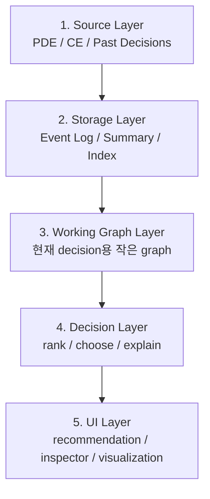
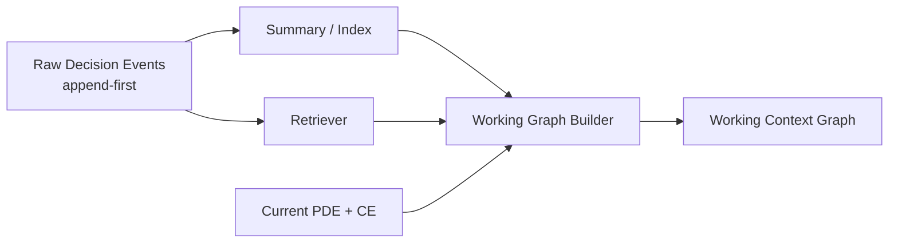
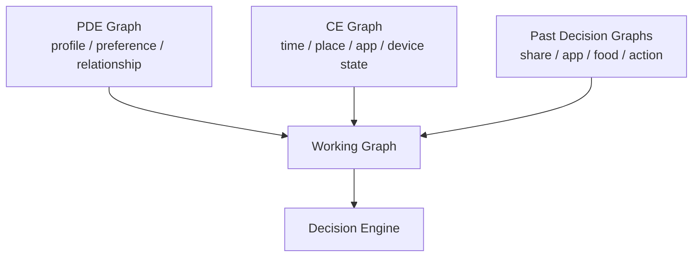
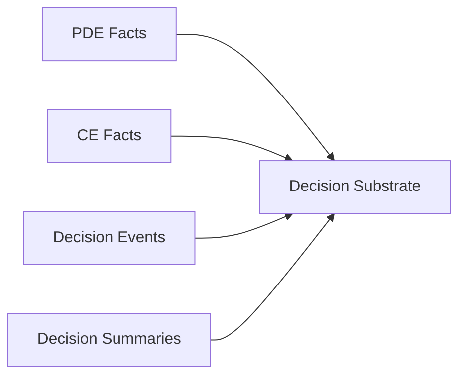
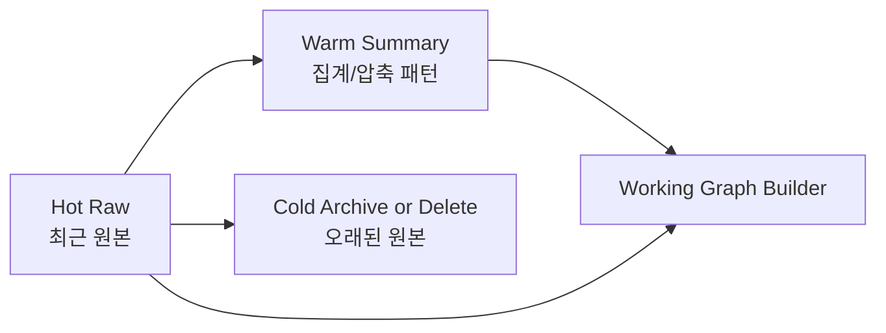
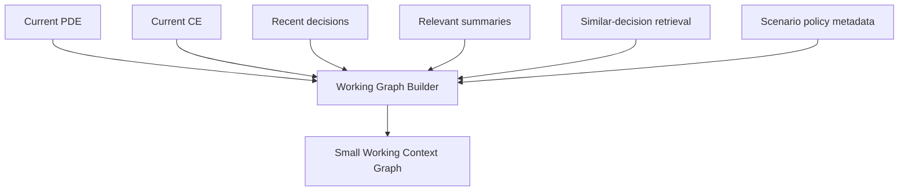
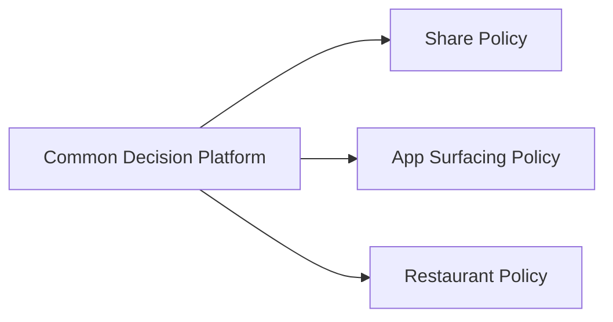

# Context Graph Decision System 설계 메모

이 문서는 이 demo를 단일 sharesheet 추천 예제가 아니라, `PDE + CE + past decisions`를 결합해 다양한 decision을 내리는 범용 decision system으로 확장하기 위한 설계 메모입니다.

현재 구현은 `share` 시나리오 하나를 vertical slice로 담고 있지만, 같은 구조는 아래 같은 decision에도 확장할 수 있습니다.

- 특정 상황에서 어떤 앱을 우선 노출할지
- 주변 음식점을 어떤 기준으로 추천할지
- 특정 intent에서 어떤 action을 먼저 surface할지

## 한눈에 보는 바운더리

먼저 시스템을 5개 레이어로 나누면 이해가 쉽습니다.

각 레이어의 책임은 아래와 같습니다.

1. `Source Layer`
   - 장기 컨텍스트(PDE), 실시간 컨텍스트(CE), 과거 결정 이력의 원천
2. `Storage Layer`
   - 원본 이벤트와 요약 데이터를 저장
3. `Working Graph Layer`
   - 현재 decision에 필요한 정보만 모아 작은 graph를 조립
4. `Decision Layer`
   - 후보를 평가하고 ranking과 explanation을 생성
5. `UI Layer`
   - 결과와 근거를 사람에게 보여줌

핵심은 `저장은 크게`, `계산은 작게`입니다.

## 현재 demo를 이 바운더리에 매핑하면

- `src/domain.ts`의 `buildContextGraph()`
  - 현재 시점 PDE + CE를 묶어 base graph를 만듦
- `src/share-history.ts`
  - past decision 역할을 하는 share history를 저장하고 graph에 합침
- `src/domain.ts`의 `rankCandidates()`
  - 현재는 share scenario 전용 ranking policy
- `src/main.ts`
  - graph, ranking, explanation을 조립해 UI에 렌더링

즉 현재 프로젝트는:

- 플랫폼 철학: 범용 context-graph decision system
- 현재 구현 범위: share scenario 1개
- 현재 history model: share event 중심
- 현재 최적화: recent raw + summary 압축

## 저장소와 working graph의 경계

가장 먼저 분리해야 할 개념은 `저장소`와 `working graph`입니다.

이 문서에서는 아래 원칙을 권장합니다.

- 원본 이벤트는 append한다
- 하지만 오래된 raw event를 매번 현재 graph에 전부 올리지는 않는다
- 현재 decision에는 `recent raw + summary + relevant retrieval result`만 사용한다

즉, `저장소 전체 = 현재 graph`가 아닙니다.

## Graph는 하나인가, 여러 개인가

제품 아키텍처 관점에서는 `여러 graph 또는 여러 graph에 해당하는 데이터 세트`가 있고, 현재 판단 시점에 그것들을 조합해 하나의 working graph를 만든다고 보는 편이 더 정확합니다.

정리하면:

- 저장 관점: giant graph 하나보다 분리된 data set이 맞음
- 실행 관점: 현재 판단 시점에는 하나의 working graph로 조립

즉 답은 `항상 하나의 초거대 graph`도 아니고, `서로 완전히 무관한 graph`도 아닙니다.

더 정확히는:

- 저장은 분리
- 참조는 연결
- 실행은 조립

## 권장 데이터 모델

범용 decision system으로 확장하려면 최소한 아래 4종류의 데이터가 필요합니다.

### 1. PDE Facts

상대적으로 안정적인 장기 정보입니다.

- 사용자 선호
- 관계/클러스터
- 자주 쓰는 앱
- 반복 루틴
- 장소 affinity

### 2. CE Facts

현재 순간의 정보입니다.

- 현재 시간대
- 현재 위치
- foreground app
- intent type
- 네트워크 상태
- 이동 중 여부

### 3. Decision Events

실제 사용자의 선택 결과를 원본 이벤트로 저장한 것입니다.

- 어떤 scenario였는지
- 어떤 candidate가 추천되었는지
- 실제로 무엇을 선택했는지
- 결과가 성공/취소/무시였는지
- 언제 발생했는지

### 4. Decision Summaries

오래된 event를 장기 패턴으로 압축한 데이터입니다.

- 선택 횟수
- 최근 선택 시각
- 최초 선택 시각
- 성공률
- 대표 context
- scenario / target / time-window 단위 집계

## Retention 전략

현재 demo는 localStorage에 raw history를 계속 append하고, graph에 올릴 때만 recent + summary 형태로 압축합니다.

장기적으로는 raw store에도 retention 정책이 필요합니다.

권장 정책은 아래와 같습니다.

### Hot Raw

- 최근 `N일` 또는 최근 `M건` raw event 유지
- 현재 decision에서 최근성 신호가 중요할 때 사용

### Warm Summary

- 오래된 raw를 scenario/entity/time-window 기준으로 요약
- 장기 personalization과 패턴 유지에 사용

### Cold Archive or Delete

- 아주 오래된 raw는 archive하거나 삭제
- summary만 장기 보존

이 구조를 쓰는 이유는 다음과 같습니다.

1. 메모리와 렌더링 비용을 bounded하게 유지할 수 있음
2. 최근 행동은 high-fidelity로 반영 가능
3. 오래된 행동은 pattern만 남겨도 충분한 경우가 많음
4. 시각화와 설명이 과도하게 비대해지지 않음

## Working Graph는 어떻게 만들까

working graph는 `현재 decision 한 번`을 위해 조립되는 작은 graph입니다.

여기서 중요한 점은, working graph가 시스템의 전체 저장소를 그대로 반영하는 것이 아니라는 것입니다.

working graph에 들어갈 후보는 보통 아래처럼 제한합니다.

- 현재 scenario와 관련된 entity만
- 최근 raw event 일부만
- retrieval score가 높은 과거 decision만
- 시각화 가능한 크기의 summary만

즉, working graph는 `materialized view`에 가깝습니다.

## Decision Layer의 공통부와 시나리오별 정책

범용 platform과 scenario policy를 분리하는 것이 중요합니다.

### 공통 platform이 담당할 것

- PDE / CE / history를 읽는 방식
- working graph를 조립하는 방식
- evidence를 만드는 방식
- retention과 summary를 관리하는 방식
- candidate evaluation pipeline의 공통 틀

### 시나리오별 policy가 담당할 것

- 후보(candidate)의 타입
- 어떤 signal을 점수화할지
- scoring / ranking 공식
- hard constraint와 fallback
- success / failure / ignore의 의미

즉 `share`, `app surfacing`, `restaurant recommendation`은 서로 다른 제품 기능이지만, 같은 substrate 위에서 정책만 바뀌는 구조로 설계할 수 있습니다.

## 확장 예시

### Share Decision

- candidate: contact / app
- signal: relationship, content type, place, time, share history
- output: share target ranking

### App Surfacing Decision

- candidate: app / shortcut / panel item
- signal: foreground app, intent type, user routine, location, recent usage
- output: 어떤 앱을 먼저 띄울지

### Restaurant Decision

- candidate: restaurant / cuisine / action
- signal: current place, time, day of week, companion, prior visits, success rate
- output: 어떤 장소나 후보를 먼저 추천할지

## 현재 repo에서 이미 보이는 방향

현재 코드에도 이 구조의 초기 힌트가 이미 있습니다.

- `buildContextGraph()`
  - PDE + CE를 묶어 current graph를 만드는 역할
- `appendShareHistoryToGraph()`
  - past decision을 graph에 연결하는 역할
- `compressShareHistoryForGraph()`
  - raw 전체를 그대로 보여주지 않고 summary로 압축하는 역할
- `rankCandidates()`
  - 현재는 share 전용이지만, 장기적으로는 scenario policy로 분리 가능한 영역

즉 현재 프로젝트는 `share recommendation app`보다는, `context graph 기반 decision platform의 첫 번째 slice`로 이해하는 것이 더 적절합니다.

## 설계 원칙 요약

이 문서의 핵심 원칙은 아래 6개입니다.

1. `append-only raw event`와 `working graph`를 분리한다
2. giant graph 하나에 모든 raw fact를 계속 붙이지 않는다
3. 현재 decision에는 작은 working graph만 사용한다
4. 오래된 raw event는 summary로 압축한다
5. 공통 decision platform과 scenario policy를 분리한다
6. graph는 설명 가능한 decision을 만들기 위한 substrate로 사용한다

## 현재 demo에서 다음 단계로 옮길 일

다음 확장을 진행한다면 우선순위는 아래 순서가 적절합니다.

1. `share history`를 `generic decision event` 개념으로 일반화
2. `share-only ranker`를 `scenario policy` 인터페이스 뒤로 이동
3. `working graph builder`를 별도 계층으로 분리
4. retention / summary 정책을 시나리오 공통 인프라로 정리
5. share 외에 `app surfacing` 또는 `restaurant recommendation` 시나리오를 하나 더 추가

이렇게 가면 현재 demo를 유지하면서도, 시스템의 본질이 `범용 context-aware decision system`이라는 점을 더 분명하게 드러낼 수 있습니다.
