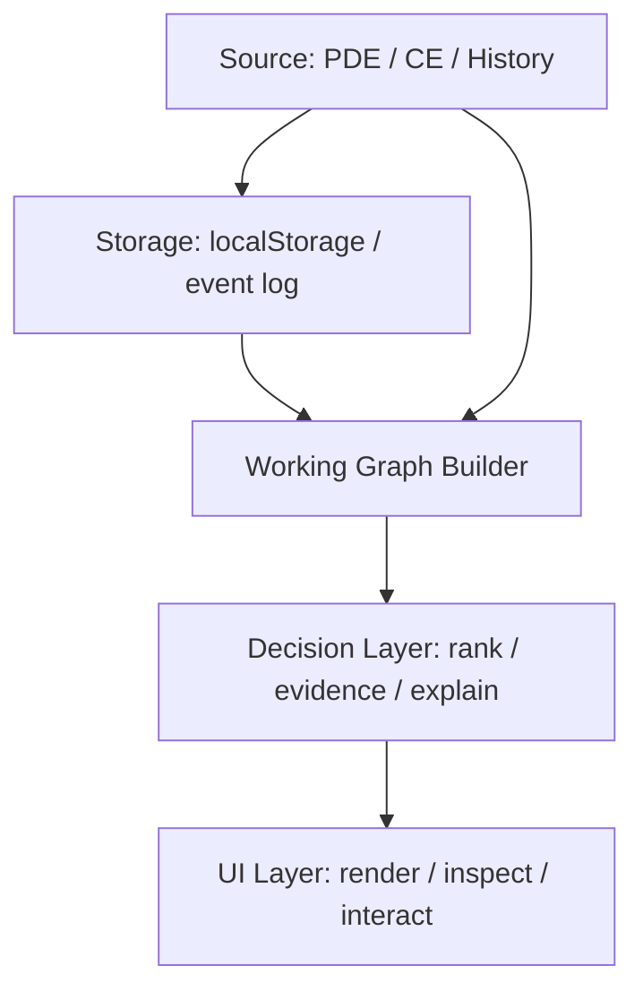

# Decision Architecture Structure Change Plan

> 목적: `docs/decision-architecture.md`에 적힌 바운더리( Source / Storage / Working Graph / Decision / UI )를 코드 구조와 문서에 더 명확하게 반영한다.

## Goal

현재 sharesheet demo를 단순한 `rankCandidates()` 중심 구조가 아니라, 아래 순서로 읽히는 decision pipeline으로 정리한다.

1. Source Layer: PDE / CE / past decisions
2. Storage Layer: raw event log + summary / index
3. Working Graph Layer: 현재 decision에 필요한 작은 graph
4. Decision Layer: ranking / evidence / explanation
5. UI Layer: 렌더링과 상호작용

핵심은 `저장은 크게, 계산은 작게`를 코드 레벨에서도 바로 보이게 만드는 것이다.

## Scope

이번 작업은 최소 침습(minimal invasive) refactor로 진행한다.

- 현재 동작은 유지한다
- share 시나리오 vertical slice는 그대로 둔다
- working graph 조립 경계를 별도 모듈로 분리한다
- UI는 orchestration만 담당하게 단순화한다
- 문서와 테스트를 먼저 작성하고, 그 다음 구현한다(TDD)

## Non-goals

- RDF 엔진 자체를 새로 구현하지 않는다
- share 이외 시나리오를 추가하지 않는다
- persistence schema를 대규모로 바꾸지 않는다
- Graph UI를 WebView로 전환하지 않는다

## Target structure



### Proposed code responsibilities

- `src/share-history.ts`
  - storage, compression, RDF triples for past events
- `src/domain.ts`
  - scenario policy, scoring, evidence generation
- `src/decision-pipeline.ts` or equivalent
  - compose base graph + history + evidence into a single workspace object
- `src/main.ts`
  - UI only: read inputs, call pipeline, render results

## TDD plan

### Step 1: Write failing tests for the new composition boundary

Add a test that proves the new workspace object contains:

- a base graph
- a working graph
- compressed history metadata
- ranking evidence
- explanation metadata that matches the working graph size

Expected initial state: test fails because the composition module does not exist yet.

### Step 2: Implement the smallest composition module

Create a thin helper that only orchestrates existing pure functions:

- `buildContextGraph()`
- `appendShareHistoryToGraph()`
- `rankCandidates()`
- `buildDecisionEvidence()`
- `explanationFor()`

### Step 3: Refactor `main.ts`

Move orchestration out of the UI file so `main.ts` becomes a consumer of the decision workspace rather than the owner of all composition logic.

### Step 4: Verify

Run:

```bash
npm test
npm run build
```

Both must pass before PR creation.

## Milestones

1. Plan markdown uploaded
2. Composition boundary tests written
3. Implementation green
4. PR created and pushed
5. GitHub Pages build verified
6. Final architecture guide written

## Notes

- Keep labels bilingual(Korean/English) where possible.
- Prefer a clear boundary diagram over extra prose.
- Do not over-engineer generic abstractions beyond what the current demo needs.
